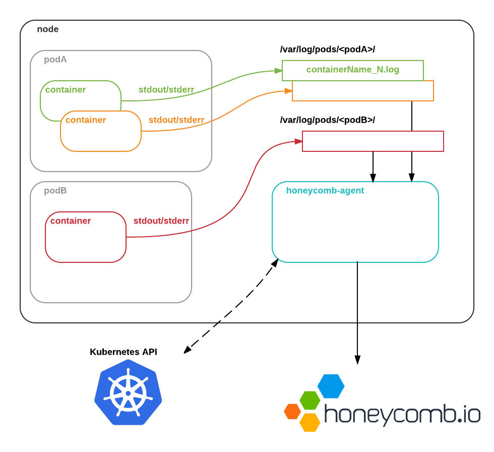

# Cluster-level Kubernetes Logging with Honeycomb

[](https://travis-ci.org/honeycombio/honeycomb-kubernetes-agent)

[Honeycomb's](https://honeycomb.io) Kubernetes agent aggregates logs across a Kubernetes cluster. Stop managing log storage in all your clusters and start tracking down real problems.

To learn more, check out the [Honeycomb general quickstart](https://honeycomb.io/get-started/), and [Kubernetes-specific docs](https://honeycomb.io/docs/connect/kubernetes/).

## How it Works

`honeycomb-agent` runs as a [DaemonSet](https://kubernetes.io/docs/admin/daemons/) on each node in a cluster. It reads container log files from the node's filesystme, augments them with metadata from the Kubernetes API, and ships them to Honeycomb so that you can see what's going on.



## Quickstart

1. Copy the example configuration file `config.yaml` from this repository.

2. Grab your Honeycomb writekey from your [account page](https://ui.honeycomb.io/account), and replace it in the config file.

3. Create a `ConfigMap` from the file:
    ```
    kubectl create honeycomb-agent-config --from-file=config.yaml --namespace=kube-system

2. Create the agent DaemonSet:
    ```
    kubectl create -f ./honeycomb-agent-ds.yml
    ```

## Production-Ready Use

### Service-specific parsing

It's best if all of your containers output structured JSON logs. But that's not
always realistic. In particular, you're likely to operate third-party services,
such as proxies or databases, that don't log JSON.

You may also want to aggregate logs from specific services, rather than from
everything that might be running in a cluster.

In order to get usefully structured data from services, you can use Kubernetes [label
selectors](https://kubernetes.io/docs/concepts/overview/working-with-objects/labels/)
to describe how to parse logs for specific services.

For example, to parse logs from pods with the label `app: nginx` as NGINX logs,
you'd specify the following configuration:

```
watchers:
- labelSelector: "app=nginx"
  parser: nginx
```
### Post-Processing Events

You might want to do additional munging of events before sending them to
Honeycomb. For each label selector, you can specify a list of `processors`,
which will be applied in order. For example:

```
watchers:
- labelSelector: "app=nginx"
  parser: nginx
  processors:
  - request_shape:            # Unpack the field "request": "GET /path HTTP/1.x
    field: request            # into its constituent components

  - drop_field:               # Remove the "user_email" field from all events
    field: user_email

  - sample:                   # Sample events: only send one in 20
    type: static
    rate: 20
```

See the [docs](/docs/example-configurations.md) for more examples.


## Development Notes

To test with locally-built images, run `eval $(minikube docker-env)`, then build the image with `docker build -t honeycombio/honeycomb-kubernetes-agent .`. See the [minikube docs](https://github.com/kubernetes/minikube#reusing-the-docker-daemon) for more details on building local images.
You will also need to mount `/mnt/sda1/var/lib/docker/containers` as a `volumeMount`.
