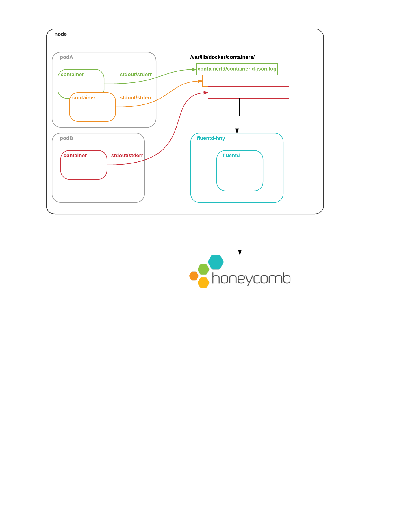

# Cluster-level Kubernetes Logging with Honeycomb

[Honeycomb's](https://honeycomb.io) Kubernetes agent aggregates logs across a Kubernetes cluster. Stop managing log storage in all your clusters and start tracking down real problems.

## How it Works

`fluentd-hny` runs as a [DaemonSet](https://kubernetes.io/docs/admin/daemons/) on each pod in the cluster. By default, containers' stdout/stderr are written by the Docker daemon to the node filesystem. `fluentd-hny` reads these logs, augments them with metadata from the Kubernetes API, and ships them to Honeycomb so that you can see what's going on.



## Setup

1. Grab your Honeycomb writekey from your [account page](https://ui.honeycomb.io/account), and store it as a Kubernetes secret:
    ```
    kubectl create secret generic honeycomb-writekey --from-literal=key=$WRITEKEY
    ```

2. Create a configMap with the `td-agent`configuration:
    ```
    kubectl create configmap td-agent-config --from-file=td-agent.conf
    ```

3. If you wish, edit `fluent-hny-ds.yml` to set the `HONEYCOMB_DATASET` environment variable to the dataset name you want.
    Then create the logging DaemonSet:
    ```
    kubectl create -f ./fluentd-hny-ds.yml
    ```

You may want to further edit the `td-agent` configuration (`td-agent.conf`) or the `fluentd-hny` spec (`fluentd-hny-ds.yml`) to suit your specific needs.

## Development Notes

For local development with `minikube`, you'll need to change the `mountPath` from `/var/lib/docker/containers/` to `/mnt/sda1/var/lib/docker/containers`.

To test with locally-built images, run `eval $(minikube docker-env)`, then build the image with `docker build -t honeycombio/fluentd-honeycomb ./fluentd-hny-image`. See the [minikube docs](https://github.com/kubernetes/minikube#reusing-the-docker-daemon) for more details on building local images.

This is loosely based on the kubernetes Elasticsearch addon:
https://github.com/kubernetes/kubernetes/tree/master/cluster/addons/fluentd-elasticsearch/fluentd-es-image
